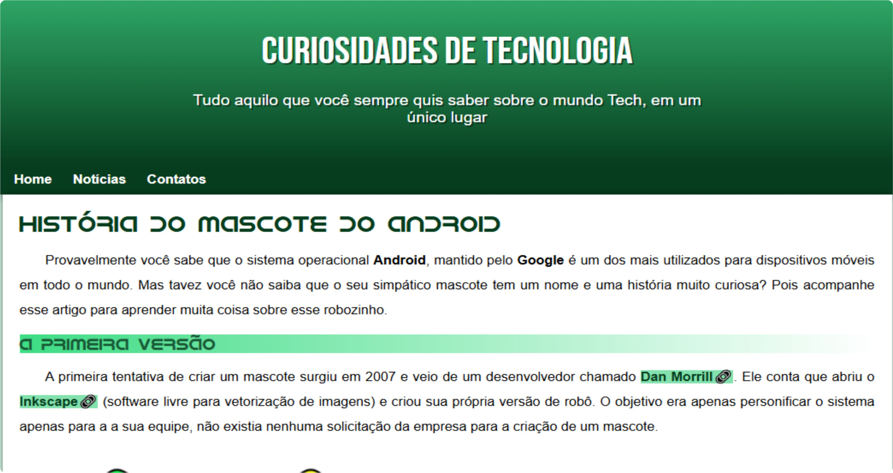

<h1 align="center">
  Site Como surgiu o mascote do Android?
</h1>

  

## 💻 Projeto

Este projeto é foi feito no curso de _HTML_ e _CSS_ do canal do youtube Curso em Vídeo.

## 🚀 Tecnologias

- HTML
- CSS

## 📔 Conhecimentos abordados

- [x] Uso semântico do HTML
- [x] Váriaveis do css no `:root`
- [x] Tornar o site responsivo

